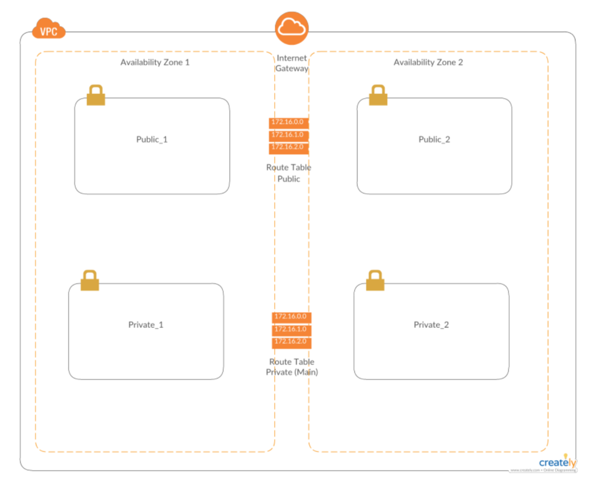

  
  
  

# Building Your First Amazon Virtual Private Cloud

## LAB Overview

#### In this lab session, you will create a basic virtual private cloud (VPC) manually. This VPC will include a frontend web server and a backend RDS subnets.

In this lab you will create:

* Create a base Amazon Virtual Private Cloud (VPC) in Ireland Region
* Create a public subnet for your web server
* Create an Internet Gateway
* Create a route table and add a route so that people can access your web server from the Internet
* Create a security group to restrict only HTTP traffic to your web server 
* Create two private subnets for your Backend MySQL server
* Create a security group for your private subnet to only allow MySQL traffic from the public subnet 

## Task 1: Create a VPC
In this task, you will create a base VPC

1. In the **AWS Management Console**, on the **Services** menu, click **VPC**.
2. In the navigation pane on the left, click **Your VPCs**.
3. Click **Create VPC**.
4. In the **Create VPC** window use the following:
   * **Name tag:** StudentX_VPC
   * **IPv4 CIDR block:** 10.X.0.0/16 (where X is your Student number)
   * Click **Create** and **Close**.

## Task 2: Create a Public Subnets

In this task, you will create a public subnets for frontend web servers.

5. In the Navigation pane on the left, click **Subnets**.
6. Click **Create Subnet**
7. In the **Create Subnet** window configure the following:
   *  **Name tag:** StudentX_Public1
   * **VPC:** StudentX_VPC (select your VPC created in Task 1)
   * **Availability Zone**: eu-west-1a (for Ireland region)
   * **IPv4 CIDR block**: 10.X.0.0/24
   * Click **Create**
8. Create second public subnet in the same way. Make sure you select the next Availability Zone. Use CIDR
   block: **10.X.1.0/24** and **eu-west-1b** Availability Zone.

Even though your subnets are labeled **Public**, they are not a public subnet. Do you now why?___

By definition a public subnet must have an Internet Gateway. In the next task you will add an Internet Gateway so that instances in your public subnets can access the Internet. 

## Task 3: Create an Internet Gateway

9. In the navigation pane on the left, click **Internet Gateways.**
10. Create an Internet Gateway by configuring the following:
    * Click **Create Internet Gateway**
    * **Name tag:** StudentX_IGW
    * Click **Create** and **Close**
    * Select checbox of newly created gateway
    * Click **Actions** button
    * Click **Attach to VPC**
    * Select your VPC and click **Attach**

This will attach the Internet Gateway to your VPC.

Even though you created an Internet Gateway and attached it to your public subnets, you still have to tell instances within your public subnets how to get to the Internet. In the next task, you will add a route to your main VPC route table to tell traffic in your public subnets how to get to the Internet. 

Each subnet in your VPC must be associated with a route table; the table controls the routing for the subnet. A subnet can only be associated with one route table at a time, but you can associate multiple subnets with the same route table. You can also have more then one route table. 

## Task 4: Route Tables and Routes

11. In the navigation pane on the left, click **Route Tables**.
There is currently one default route table associated with the VPC that you created.

12. Select the route that is associated with your VPC.
13. Click the **Routes** tab.
Notice that there is one route in your route table that is associated with your default network. This route allows traffic from the 10.X.0.0/16 network to pass to other nodes within the network, but it does not allow traffic to go outside of the network. Next, you will create a new route table dedicated for a public subnets and add a route to allow traffic to get to the Internet.

14. Click **Create route table**, and provide following informations:
    * **Name tag**: StudentX_RTP
    * **VPC**: select your VPC
15. Click **Create** and **Close**
16. Select a newly created routing table.
17. Switch to the **Routes** tab and click **Edit routes**.
18. Click **Add route**.
19. Click the **Destination** field and enter: **0.0.0.0/0**
20. Click the **Target** field.
21. Click the Internet Gateway that you created earlier in task 3.
22. Click **Save routes** and **Close**.
23. Switch to the **Subnet Associations** tab and click **Edit subnet associations**.
24. Select both Public1 and Public2 subnets and click **Save**.

You have now fully configured your public subnets so that traffic within it can get out to the Internet. In the next Labs you will create a web server in the this public subnet. But before that, you need to control the traffic that is allowed to access your web server. You can do this by creating a security group that only allows HTTP traffic and attaching the security group to your web server.

A security group acts as a virtual firewall for your instance to control inbound and outbound traffic. When you launch an instance in a VPC, you can assign up to five security groups to the instance. Security groups act at the instance level, not the subnet level. Therefore, each instance in a subnet in your VPC could be assigned to a different set of security groups. If you don't specify a particular group at launch time, the instance is automatically assigned to the default security group for the VPC.

## Task 5: Create a Security Group For Your Public Subnet

In this task, you will add a security group so that people can access your web server using HTTP.

25. In the Navigation pane on the left, click **Security Groups**.
26. Click **Create security group**.
27. In the **Create security group** window, configure the following: 
    *  **Security group name:** StudentX_WebServers
    *  **Description**: StudentX Web Servers Security Group
    *  **VPC**: Select your VPC 
    *  Click **Create** and **Close**
28. Select your security group you just created.
29. Click the **Inbound Rules** tab.
30. Click **Edit rules**.
31. Click **Add Rule**.
32. Click the **Custom TCP Rule** drop-down arrow and select HTTP (80).
33. Click the **Source** box and enter: **0.0.0.0/0**
34. Click **Save rules** and **Close**.

## Task 6: Create a Private Subnets For Your Backend MySQL Server

To deploy your RDS database, your VPC must have at least one subnet in at least two Availability Zones in
the region where you want to deploy your DB instance. In this task, you'll create your private subnets for
your soon to be created Amazon RDS instance.

35. On the **Services** menu, click **VPC**.
36. In the navigation menu on the left, click **Subnets**.
37. Click **Create subnet**.
38. In the **Create subnet** window configure the following:
   * **Name tag**: StudentX_Private1
   * **VPC**: Select your VPC
   * **Availability Zone**: eu-west-1a
   * **IPv4 CIDR block**: 10.X.10.0/24
   * Click **Create** and **Close**.
37. Repeat the same steps and create second private subnet. Use CIDR block **10.X.11.0/24** and **eu-west-1b**
   Availability Zone.

## Task 9: Create a Security Group For Your Backend SQL Server

Now that your private subnets are configured, you'll want to secure the types of traffic that can access your
MySQL database. In this task, you'll create a security group to only allow MySQL traffic from your public
subnets.

38. In the Navigation pane on the left, click **Security Groups**.
39. Click **Create security group**.
40. In the **Create security group** window, configure the following:
   * **Security group name**: StudentX_DB
   * **Description**: StudentX Database Security Group
   * **VPC**: Select your VPC 
   * Click **Create** and **Close**
41. Select your security group you just created.
42. Click the **Inbound Rules** tab.
43. Click **Edit rules**.
44. Click **Add Rule**.
45. Click the **Custom TCP Rule** drop-down arrow and select **MySQL/Aurora (3306)**. 
46. Click the **Source** box and enter: **10.X.0.0/22**
47. Click **Save rules** and **Close**.

This rule states that only MySQL traffic coming from your public subnets is allowed to access the database
in the Private subnets.

## END LAB

### Conclusion

In this lab you created a VPC with a two public subnets and two private subnets. AWS provides you with access to multiple Availability Zones at no additional cost. A best practice is to mirror servers across two Availability Zones and then use load balancing and other techniques in order to distribute traffic between them. 

Security group rules can be either very precise or quite loose. You need to ensure that your security groups are as restrictive as possible but not so restrictive that there are unintended side effects. 

  

&copy; 2019 Chmurowisko Sp. z o.o.

