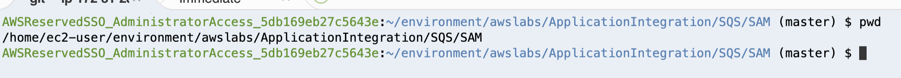
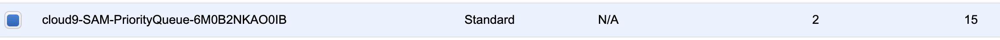

  
  
  

# SQS - Serverless Apllication

## LAB Overview

#### This lab will whow you how use queues, lambda functions and API Gateway. You'll also learn how to easilly decouple your application.

#### This lab will demonstrate:

You'll create serverless application that consists of:
* API Gateway endpoint
* Three Lambda functions
* Two or three SQS queues

By sending any GET request to your API Gateway endpoint you will invoke main API Function. Depending on the requester IP address this Lambda will send message to priority or standard queue. Priority for IP address defined as env variable.

Both SQS queues will trigger different Lambda functions. One for standard and one for prority queue.

## Task 1. Prepare Cloud9 environment

In this task you will prepare Cloud9 devevlopment environment to work on your project.

If you have you Cloud9 environmant ready, you can move on to task 2.

1. In the AWS Management Console, on the **Services** menu, click **Cloud9**.
2. Click **Create environment**.
3. Enter a name for your environment, e.g. "student-x-environment".
4. Click **Next step**.
5. As "Environment type" select *Create a new instance for environment (EC2)*.
6. Select *t2.micro* as "Instance type".

7. Select *Amazon Linux* as **Platform**.
8. Set **Cost-saving setting** to *After 30 minutes (default)*.
9. Click **Next step**.
10. Review your environment and click **Create environment**.

## Task 2. Clone repository

In this tak you'll learn how to clone remote code repository from GitHub and use the code inside of your Cloud9 environment.

1. In the AWS Management Console, on the **Services** menu, click **Cloud9**.
2. Find your environment and open it by clicking **Open IDE**.
3. In the terminal window enter

``git clone https://github.com/cloudstateu/awsarch0519.git``

4. In the terminal window enter ``ls`` and hit **Enter**.
5. In the terminal window enter ``mv awsarch0519/DAY4/D4-L2-SAM+SQS/SAM ./``
6. Click **Refresh** button in the **AWS Resources** tab on the right.

Now you have several files inside *SAM* drectory. The *template.json* file is a template for the whole serveless application with resources defined using IaaC.
Three Lambda functions source code are available inside next subdirectories: APIFunction, Priority QueueFunction and StandardQueueFunction.

7. Open *template.json* file and edit it by changing IP address to the one you'll use in the next steps to connect to your application.

8. Save all changes.
## Task 3. Deploy all configuration

In this task you will deploy all the resources to AWS.

1. In the terminal window enter your application directory by typing
``cd ApplicationIntegration/SQS/SAM/``
and hiting **Enter**.

2. Check if you're in the correct directory by typing
``pwd`` and hitting **Enter**.

3. Create local virtual environment for your application. In the terminal window type
``virtualenv -p python3 venv``
and hit enter.

When everything is ready...

4. Right click on your SAM directory and select **Deploy**.

Your serverless app should start being deployed. You can check **CloudFormation** to see if there is anything new.

## Task 4. Test deployed application

In this task you will test the solution. You have deployed API endoint that works as a proxy for main Lambda function *APIFunction*.

1. In the AWS Management Console, on the **Services** menu, click **CloudFormation**.
2. Find a stack you've deployed a moment ago and click on its name.
3. Scroll down to **Resources** and find API Gateway that AWS created for you. Its **LogicalID** should be similiar or equal to *ServerlessRestApi*.
4. Click on the **PhisicalID** next to the right and open API Gateway console.
5. Find your API and click on its name.
6. Select **Stages**.
7. Select **Prod** stage.
8. Click on the **Invoke URL**.

If you're connecting from the address defined as Lambda variable (you can change it by editing *template.json* file and redeploying the app) you should get *Cheers from AWS Lambda!!".

9. Copy the url and go back to your Cloud9 environment.
10. In the terminal window type
``curl <your endpoint address>``
and hit enter.

11. Repeat both requests several times.

## Task 5. Verify your queue 

In this task you will check if there is anything left in the queues and will look into Lambda functions logs to see if they were triggered by the messages.

1. In the AWS Management Console, on the **Services** menu, click **SQS**.
2. Find any of your queues, click on it and check if there are any messages left.
3. Open **Details** tab and look into properties of the queue.

4. In the AWS Management Console, on the **Services** menu, click **Lambda**.
5. Find your function connected to standard or priority queue and click on its name.
6. Click **Monitoring** and click **View logs in CloudWatch**.
7. Look into topmost LogGroup and see log entries.

## Task 6. Use Dead Letter Queue

In this task you will see Dead Letter Queue. It's the queue that is used when messages can't be consumed in a normal manner. It there is eception or so. Each message will trigger a Lambda 5 times and then it will be removed ftom the queue and sent to DLQ.

1. Go back to your Cloud9 environment.
2. Open *template.json* file and replace its content with the content of [template_dlq](SAM/template_dlq.yaml).file
3. Look ino lines 67 and 74. You added redrive ploity together with DLQ queue.
4. Open *PriorityQueueFunctio/lambda_function.py* file and uncomment line 5.
5. Save all changes and redeploy.
6. Go back you your web browser and invoke your API using priority IP. 3 or 5 times.
7. In the AWS Management Console, on the **Services** menu, click **SQS**.
8. Find your queues. Now there must be three of them. Find your DLQ queue and click on its name. There may be a few messages in flight right now.

9. Wait a minute or so and refresh the screen. Now all your messages should be moved do DQL queue.

## 

## END LAB

This is all, you can clean up your AWS account and delete resources used in this lab.

1. In the AWS Management Console, on the **Services** menu, click **CloudFormation**.
2. Find the stack your template created, checke the checkmark left to the stack name.
3. Open **Actions** menu, select **Delete stack**.
4. Click **Yes, Delete**.

  
